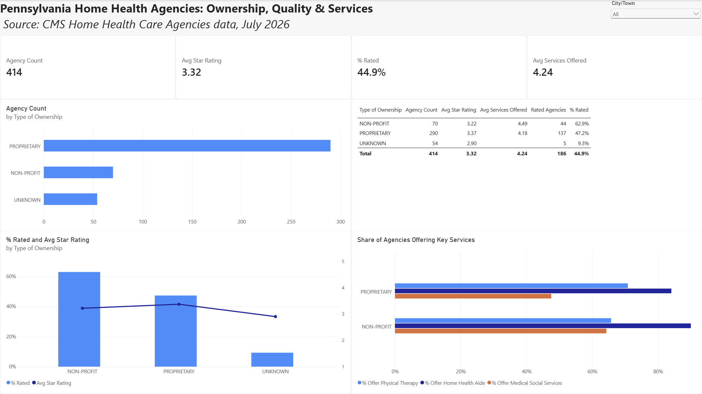

# Pennsylvania Home Health Agencies: Ownership, Quality & Services



## The Question
Do for-profit home health agencies in Pennsylvania get lower quality ratings, or offer fewer services, than non-profit agencies?

## Short Answer
- **Ratings:** No, at least not among rated agencies. Rated for-profit agencies average **3.37 stars** vs **3.22** for non-profits. But only **47%** of for-profits have a rating at all, compared to **63%** of non-profits, so this comparison only covers part of the picture.
- **Services:** Slightly fewer overall (**4.18** vs **4.49** of 6 services). The biggest gap is **medical social services**, offered by about **48%** of for-profits vs about **64%** of non-profits.

## The Data
- **Source:** CMS Home Health Care Agencies dataset (July 2026), filtered to Pennsylvania
- **Size:** 415 PA agencies (414 analyzed; 1 government-operated agency excluded)
- **Tools:** Power BI Desktop (Power Query, DAX)

## How I Cleaned It (Power Query)
- Filtered the national dataset down to Pennsylvania (415 agencies).
- Cut the dataset from 96 columns down to the 12 needed to answer the question.
- Fixed ID-type columns: the CMS Certification Number and ZIP Code were auto-detected as numbers, which stripped leading zeros. Changed both to text, since they're identifiers, not values to do math on.
- Handled missing values (`-`) based on column type:
  - **Star rating (number):** replaced `-` with `null` so averages skip missing values instead of counting them as zero.
  - **Ownership (category):** replaced `-` with `UNKNOWN` so those agencies stay visible as their own group.
  - **Service columns:** converted Yes/No to 1/0, and `-` to `null`.
- Created a **Services Offered** column (0–6) by adding up the six service columns with `List.Sum`, which ignores nulls.
- Renamed columns and the table for readability.

## Measures (DAX)
```
Agency Count = COUNTROWS(Agencies)
Avg Star Rating = AVERAGE(Agencies[Star Rating])
Avg Services Offered = AVERAGE(Agencies[Services Offered])
Rated Agencies = COUNT(Agencies[Star Rating])
% Rated = DIVIDE([Rated Agencies], [Agency Count])
% Offer Physical Therapy = AVERAGE(Agencies[Offers Physical Therapy Services])
```
The "% Offer" measures work because the service columns are 1/0, so the average of a column is the share of agencies offering that service.

## Key Findings
- **For-profits dominate:** 290 of 414 agencies (70%) are for-profit ("proprietary").
- **Most agencies aren't rated:** only **44.9%** of PA agencies have a CMS quality star rating.
- **Rated for-profits score slightly higher** (3.37 vs 3.22 stars), but they're much less likely to be rated (47% vs 63%).
- **For-profits offer fewer social services:** medical social services are the largest service gap (about 48% vs 64%). Physical therapy is actually slightly *more* common at for-profits (about 71% vs 66%).
- **54 agencies have no ownership listed.** Almost none of them are rated (5 of 54) and none have service data, which suggests they may be newer agencies with incomplete records.

## Limitations
- **Selection bias in ratings:** CMS only rates agencies with enough patient data. Since fewer than half of agencies are rated, and for-profits are rated less often, the rating comparison may not represent all agencies.
- **UNKNOWN group:** the "lower ratings" for unknown-ownership agencies are based on only 5 rated agencies.
- **Services Offered undercount:** agencies with missing values in some service columns may score slightly lower than they really are.
- **Government agencies excluded:** only 1 government-operated agency, too small a group to compare.
- **Snapshot:** this is one month of data (July 2026), so it can't show trends over time.

## Files
- `PA_Home_Health_Analysis.pbix`: Power BI report (open with Power BI Desktop, free)
- `PA_Home_Health_Analysis.pdf`: PDF export of the dashboard
- `Dashboard.png`: dashboard screenshot
